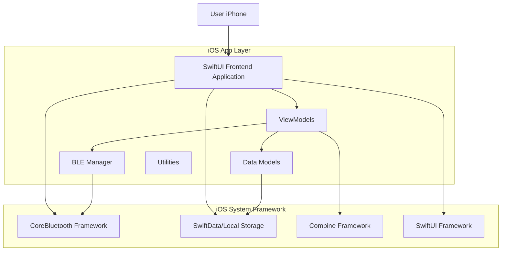

# iOS SwiftUI 项目架构文档 - RadarSwitch iOS版

## 1. 架构设计



## 2. 技术描述

### 核心技术栈
- **开发语言**: Swift 5.9+
- **UI框架**: SwiftUI 5.0+
- **最低系统版本**: iOS 16.0+
- **蓝牙通信**: CoreBluetooth框架
- **数据存储**: SwiftData (iOS 17+) / UserDefaults
- **状态管理**: Combine框架
- **构建工具**: Xcode 15+

### 主要依赖库
- **CoreBluetooth**: 系统BLE通信
- **Combine**: 响应式编程
- **SwiftData**: 数据持久化
- **SwiftUI**: 声明式UI

## 3. 核心功能模块

### 3.1 蓝牙通信模块 (BLEManager)
```swift
class BLEManager: NSObject, ObservableObject, CBCentralManagerDelegate, CBPeripheralDelegate {
    // 设备扫描与连接
    func scanForDevices()
    func connectToDevice(_ peripheral: CBPeripheral)
    func disconnectFromDevice(_ peripheral: CBPeripheral)
    
    // 数据通信
    func sendCommand(_ command: String, to peripheral: CBPeripheral)
    func readCharacteristic(_ characteristic: CBCharacteristic, from peripheral: CBPeripheral)
    
    // 状态管理
    @Published var isScanning: Bool = false
    @Published var connectedDevices: [CBPeripheral] = []
    @Published var discoveredDevices: [ScanResult] = []
}
```

### 3.2 数据模型 (Data Models)
```swift
// 设备模型
struct Device: Identifiable, Codable {
    let id: UUID
    var name: String
    var macAddress: String
    var rssi: Int
    var isConnected: Bool
    var lastSeen: Date
}

// 参数配置模型
struct DeviceParameters: Codable {
    var range1: Double  // 最小距离
    var range2: Double  // 中等距离
    var range3: Double  // 最大距离
    var sensitivity: Int
    var enterDelay: Int  // 进入延迟
    var exitDelay: Int   // 离开延迟
    var holdFrame: Int
    var trith: Int
    var fastTime: Int
    var slowTime: Int
}

// 日志数据模型
struct LogEntry: Identifiable, Codable {
    let id: UUID
    let timestamp: Date
    let type: LogType
    let message: String
    let distance: Double?
    let targetType: TargetType?
}

enum LogType: String, Codable {
    case alarm, noAlarm, system, parameter
}

enum TargetType: String, Codable {
    case moving, microMotion
}
```

### 3.3 视图模型 (ViewModels)
```swift
// 主视图模型
@MainActor
class MainViewModel: ObservableObject {
    @Published var selectedTab: Tab = .scan
    @Published var devices: [Device] = []
    @Published var logs: [LogEntry] = []
    @Published var parameters: DeviceParameters?
    @Published var isLoading: Bool = false
    @Published var errorMessage: String?
    
    // 蓝牙管理
    let bleManager = BLEManager()
    
    // 核心功能方法
    func scanForDevices()
    func connectToDevice(_ device: Device)
    func loadParameters(for device: Device)
    func saveParameters(_ parameters: DeviceParameters, for device: Device)
    func restoreDefaults(for device: Device)
    func loadLogs(for device: Device, limit: Int)
}

// 参数配置视图模型
class ParametersViewModel: ObservableObject {
    @Published var parameters: DeviceParameters?
    @Published var isReadOnly: Bool = true
    @Published var isEditing: Bool = false
    
    func toggleEditMode()
    func saveChanges()
    func discardChanges()
}

// 日志监控视图模型
class LogsViewModel: ObservableObject {
    @Published var logEntries: [LogEntry] = []
    @Published var logLimit: Int = 20
    @Published var isRealTimeMonitoring: Bool = true
    
    func refreshLogs()
    func clearLogs()
    func changeLogLimit(_ limit: Int)
}
```

## 4. 路由定义

| 路由 | 目的 |
|------|------|
| / | 主页面，包含底部导航栏 |
| /scan | 蓝牙设备扫描页面 |
| /devices | 已连接设备列表页面 |
| /parameters | 设备参数配置页面 |
| /logs | 设备日志监控页面 |
| /settings | 应用设置页面 |

## 5. UI界面设计

### 5.1 设计规范
- **主色调**: 深蓝色 (#0c1f37)
- **辅助色**: 浅蓝色 (#9bb3d6)
- **背景色**: 深色模式优先
- **按钮样式**: 圆角矩形，渐变背景
- **字体**: SF Pro Display / SF Pro Text
- **图标**: SF Symbols
- **布局**: 卡片式布局，圆角设计

### 5.2 核心页面设计

#### 扫描页面 (ScanView)
```swift
struct ScanView: View {
    @ObservedObject var viewModel: MainViewModel
    @State private var isScanning: Bool = false
    
    var body: some View {
        NavigationView {
            List(viewModel.devices) { device in
                DeviceRow(device: device) {
                    viewModel.connectToDevice(device)
                }
            }
            .navigationTitle("蓝牙扫描")
            .toolbar {
                ToolbarItem(placement: .navigationBarTrailing) {
                    Button(action: { viewModel.scanForDevices() }) {
                        Image(systemName: "arrow.clockwise")
                    }
                }
            }
        }
    }
}
```

#### 参数配置页面 (ParametersView)
```swift
struct ParametersView: View {
    @ObservedObject var viewModel: ParametersViewModel
    @State private var showingEditAlert: Bool = false
    
    var body: some View {
        Form {
            Section(header: Text("感应距离设置")) {
                DistanceSlider(title: "最小距离", value: $viewModel.parameters.range1, range: 0...6)
                DistanceSlider(title: "中等距离", value: $viewModel.parameters.range2, range: 0...6)
                DistanceSlider(title: "最大距离", value: $viewModel.parameters.range3, range: 0...6)
            }
            
            Section(header: Text("延时设置")) {
                DelaySlider(title: "进入延迟", value: $viewModel.parameters.enterDelay, range: 1...20)
                DelaySlider(title: "离开延迟", value: $viewModel.parameters.exitDelay, range: 1...999)
            }
            
            Section {
                Button(action: { showingEditAlert = true }) {
                    Text(viewModel.isReadOnly ? "切换到编辑模式" : "保存参数")
                }
                .disabled(viewModel.isReadOnly)
            }
        }
        .navigationTitle("参数配置")
    }
}
```

#### 日志监控页面 (LogsView)
```swift
struct LogsView: View {
    @ObservedObject var viewModel: LogsViewModel
    
    var body: some View {
        VStack {
            LogChartView(logEntries: viewModel.logEntries)
            
            List(viewModel.logEntries) { log in
                LogRow(logEntry: log)
            }
            
            HStack {
                Picker("日志条数", selection: $viewModel.logLimit) {
                    Text("5条").tag(5)
                    Text("10条").tag(10)
                    Text("20条").tag(20)
                }
                .pickerStyle(SegmentedPickerStyle())
                
                Spacer()
                
                Button("刷新") {
                    viewModel.refreshLogs()
                }
            }
            .padding()
        }
        .navigationTitle("日志监控")
    }
}
```

### 5.3 自定义组件

```swift
// 距离滑块组件
struct DistanceSlider: View {
    let title: String
    @Binding var value: Double
    let range: ClosedRange<Double>
    
    var body: some View {
        VStack(alignment: .leading) {
            Text(title)
                .font(.headline)
            HStack {
                Slider(value: $value, in: range, step: 0.1)
                Text(String(format: "%.1f米", value))
                    .frame(width: 60)
            }
        }
    }
}

// 设备行组件
struct DeviceRow: View {
    let device: Device
    let onConnect: () -> Void
    
    var body: some View {
        HStack {
            VStack(alignment: .leading) {
                Text(device.name)
                    .font(.headline)
                Text("RSSI: \(device.rssi)dBm")
                    .font(.caption)
                    .foregroundColor(.secondary)
            }
            
            Spacer()
            
            if device.isConnected {
                Image(systemName: "checkmark.circle.fill")
                    .foregroundColor(.green)
            } else {
                Button("连接") {
                    onConnect()
                }
                .buttonStyle(BorderlessButtonStyle())
            }
        }
    }
}

// 日志行组件
struct LogRow: View {
    let logEntry: LogEntry
    
    var body: some View {
        VStack(alignment: .leading, spacing: 4) {
            HStack {
                Text(logEntry.timestamp, style: .time)
                    .font(.caption)
                Spacer()
                LogTypeBadge(type: logEntry.type)
            }
            
            Text(logEntry.message)
                .font(.body)
            
            if let distance = logEntry.distance {
                Text("距离: \(String(format: "%.2f", distance))米")
                    .font(.caption)
                    .foregroundColor(.secondary)
            }
        }
        .padding(.vertical, 4)
    }
}
```

## 6. 蓝牙通信协议

### 6.1 BLE服务和特征值
```swift
// BLE服务UUID
struct BLEConstants {
    static let serviceUUID = CBUUID(string: "0000FFF0-0000-1000-8000-00805F9B34FB")
    static let characteristicUUID = CBUUID(string: "0000FFF1-0000-1000-8000-00805F9B34FB")
    static let cccUUID = CBUUID(string: "00002902-0000-1000-8000-00805F9B34FB")
}
```

### 6.2 命令格式
```swift
// AT命令枚举
enum ATCommand: String {
    case read = "AT+READ"
    case save = "AT+SAVE"
    case reset = "AT+INIT"
    case setRange1 = "AT+RANGE1="
    case setRange2 = "AT+RANGE2="
    case setRange3 = "AT+RANGE3="
    case setSensitivity = "AT+SENS="
    case setEnterDelay = "AT+STIME="
    case setExitDelay = "AT+HOLD="
}
```

### 6.3 数据解析
```swift
// 日志解析器
class LogParser {
    static func parseLog(_ rawString: String) -> [LogEntry] {
        var entries: [LogEntry] = []
        let lines = rawString.components(separatedBy: .newlines)
        
        for line in lines {
            if line.contains("have alarm") {
                entries.append(LogEntry(
                    id: UUID(),
                    timestamp: Date(),
                    type: .alarm,
                    message: "检测到目标",
                    distance: nil,
                    targetType: nil
                ))
            } else if line.contains("no alarm") {
                entries.append(LogEntry(
                    id: UUID(),
                    timestamp: Date(),
                    type: .noAlarm,
                    message: "未检测到目标",
                    distance: nil,
                    targetType: nil
                ))
            } else if let parsed = parseTargetLine(line) {
                entries.append(parsed)
            }
        }
        
        return entries
    }
    
    private static func parseTargetLine(_ line: String) -> LogEntry? {
        // 解析格式: "1,R:572cm,P:16"
        let pattern = "([12]),R:(\\d+)cm,P:(\\d+)"
        guard let regex = try? NSRegularExpression(pattern: pattern),
              let match = regex.firstMatch(in: line, range: NSRange(line.startIndex..., in: line)) else {
            return nil
        }
        
        let targetType = TargetType(rawValue: line[Range(match.range(at: 1), in: line)!] == "1" ? "moving" : "microMotion")
        let distance = Double(line[Range(match.range(at: 2), in: line)!])! / 100.0
        
        return LogEntry(
            id: UUID(),
            timestamp: Date(),
            type: .alarm,
            message: "检测到\(targetType == .moving ? "运动" : "微动")目标",
            distance: distance,
            targetType: targetType
        )
    }
}
```

## 7. 数据持久化

### 7.1 SwiftData模型
```swift
@Model
class PersistentDevice {
    var id: UUID
    var name: String
    var macAddress: String
    var lastConnected: Date
    var parameters: Data?
    
    init(id: UUID, name: String, macAddress: String) {
        self.id = id
        self.name = name
        self.macAddress = macAddress
        self.lastConnected = Date()
    }
}
```

### 7.2 用户偏好设置
```swift
@Observable
class UserPreferences {
    @AppStorage("logLimit") var logLimit: Int = 20
    @AppStorage("chartTimeWindow") var chartTimeWindow: Int = 180
    @AppStorage("language") var language: String = "zh"
    @AppStorage("isDarkMode") var isDarkMode: Bool = true
}
```

## 8. 权限管理

### 8.1 Info.plist配置
```xml
<key>NSBluetoothAlwaysUsageDescription</key>
<string>此应用需要蓝牙权限来连接和配置雷达开关设备</string>
<key>NSBluetoothPeripheralUsageDescription</key>
<string>此应用需要蓝牙权限来发现和连接附近的DC59X设备</string>
```

### 8.2 权限请求
```swift
import CoreBluetooth

class PermissionManager: NSObject, ObservableObject {
    @Published var bluetoothState: CBManagerState = .unknown
    
    func requestBluetoothPermission() {
        // iOS自动处理蓝牙权限请求
        // 需要在Info.plist中添加相应的描述
    }
    
    func checkBluetoothAvailability() -> Bool {
        return bluetoothState == .poweredOn
    }
}
```

## 9. 错误处理与状态管理

### 9.1 错误类型定义
```swift
enum AppError: LocalizedError {
    case bluetoothUnavailable
    case deviceNotFound
    case connectionFailed
    case commandFailed(String)
    case parseError(String)
    case saveFailed(String)
    
    var errorDescription: String? {
        switch self {
        case .bluetoothUnavailable:
            return "蓝牙不可用，请检查蓝牙设置"
        case .deviceNotFound:
            return "未找到指定设备"
        case .connectionFailed:
            return "设备连接失败"
        case .commandFailed(let reason):
            return "命令执行失败: \(reason)"
        case .parseError(let message):
            return "数据解析错误: \(message)"
        case .saveFailed(let reason):
            return "保存失败: \(reason)"
        }
    }
}
```

### 9.2 状态管理
```swift
enum AppState {
    case idle
    case scanning
    case connecting
    case connected(Device)
    case readingParameters
    case writingParameters
    case error(AppError)
}
```

## 10. 测试策略

### 10.1 单元测试
- BLEManager连接测试
- 数据解析测试
- 参数验证测试
- 错误处理测试

### 10.2 UI测试
- 界面响应测试
- 用户交互测试
- 状态变化测试

### 10.3 集成测试
- 端到端BLE通信测试
- 设备连接稳定性测试
- 参数读写一致性测试

## 11. 部署与发布

### 11.1 构建配置
- **Development Team**: 配置Apple开发者账号
- **Bundle Identifier**: com.dingtek.radarswitch-ios
- **Version**: 1.0.0 (初始版本)
- **Build Number**: 自动递增

### 11.2 App Store配置
- **应用名称**: RadarSwitch iOS
- **应用描述**: 专业的雷达开关配置与诊断工具
- **关键词**: 雷达开关, BLE, 配置工具, 物联网
- **隐私政策**: 符合Apple隐私要求
- **年龄分级**: 4+

### 11.3 测试Flight
- 内部测试: 25名测试人员
- 外部测试: 1000名测试人员
- 测试周期: 2-4周

这个架构文档提供了从Android到iOS的完整迁移方案，保持了原有功能的同时充分利用了iOS平台的特性和优势。