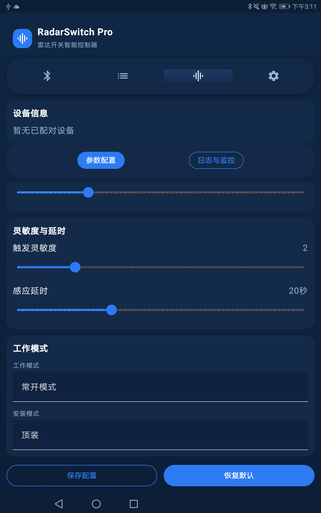
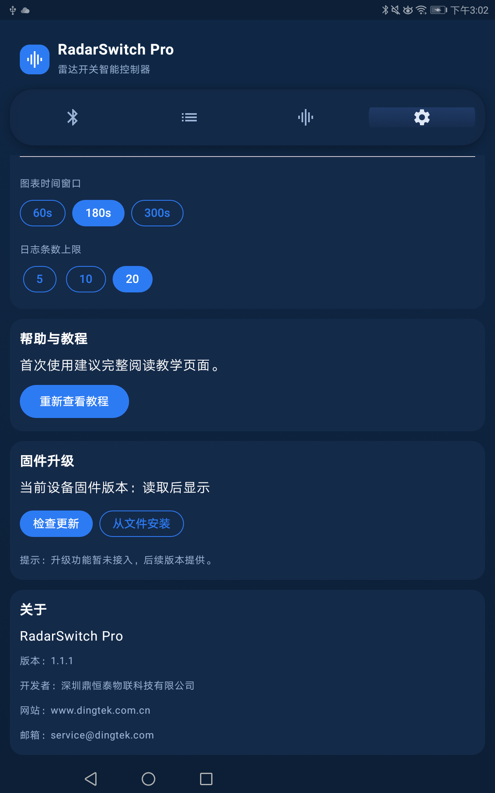

[中文](#zh) | [English](#en)

# RadarSwitch（雷达开关 DC59X）

RadarSwitch 是用于 CNDingtek 雷达开关 DC59X 的配置与诊断工具，基于 Android（Jetpack Compose + Kotlin）。支持通过蓝牙（BLE）扫描并连接设备、读取与修改参数、查看设备返回日志及距离信息，辅以“恢复默认”及只读模式，便于快速定位与安全调整。

## 功能说明
- 蓝牙扫描与连接：
  - 扫描附近的 DC59X 设备，选择后建立 BLE 连接。
- 参数读取与修改：
  - 进入参数配置页面可读取设备参数；退出只读模式后可进行参数修改与保存。
- 日志查看与距离诊断：
  - 支持查看设备返回的运行日志与距离信息，默认显示最近 20 条日志（可在设置页调整）。
  - 采用增量读取的"最后 N 行"策略，兼容原始日志列表被设备裁剪的情况，保证解析稳定。
  - 日志格式解析：
    - `have alarm\r\n`：检测到目标（无需解析具体信息）。
    - `no alarm\r\n`：未检测到目标。
    - `{目标类型},R:{距离值}cm,P:{能量值}\r\n`：
      - 目标类型：1 为运动目标，2 为微动目标。
      - 距离值：检测到目标的距离，单位为 cm。
      - 能量值：不进行解析。
      - 示例：`1,R:572cm,P:16\r\n` 表示检测到运动目标，距离 572cm。
      - 示例：`2,R:355cm,P:318\r\n` 表示检测到微动目标，距离 355cm。
- 恢复默认与距离计算：
  - 在“恢复默认”后进入等待设备响应状态，按设备返回令牌自动计算距离：
    - 最大距离：优先使用 `Range3/MR3`；若未收到，则保持默认值 `6.0`。
    - 最小距离：优先使用 `Range1/MR1` 并结合最大距离计算；若无法计算（例如未收到 `Range1`），兜底为 `0.0`。
  - 当最大/最小距离刷新后立即保存并结束等待状态，确保页面停留时数据能及时更新。
- 只读模式（默认开启）：
  - 进入参数页面时默认选中“只读”，避免误操作；切换为“可编辑”后可修改参数。
- 设置页：
  - 日志条数上限：提供 5、10、20 三档，默认 20。
  - 其他与诊断相关的显示/行为设置。

## 设计需求与约束
- 平台与兼容性：
  - 最低支持 `minSdk=24`，目标 `targetSdk=34`。
- 交互与安全：
  - 只读模式默认开启，需显式切换到“可编辑”后才允许修改参数。
  - 恢复默认后以设备响应为主进行距离计算，保证数据可靠性。
- 日志解析策略：
  - 增量读取采用“最后 N 行”，避免设备端裁剪导致的解析缺失。
- 构建与告警：
  - 当前版本存在 `textFieldColors`、`quadraticBezierTo` 的弃用告警，不影响功能；后续将逐步替换对应 API。

## 使用说明
1. 安装与权限：
   - 从 Release 页面下载并安装 `app-release.apk`；如已安装 Debug 版，请先卸载以避免签名冲突。
   - 首次运行时授予蓝牙与定位相关权限，用于设备扫描与连接。
2. 扫描与连接：
   - 打开应用，进入扫描页，选择列表中的 DC59X 设备并建立连接。
3. 参数查看与编辑：
   - 进入参数配置页，默认为“只读”状态；如需修改参数，切换到“可编辑”并在完成后保存。
4. 恢复默认与距离刷新：
   - 在“恢复默认”页面点击按钮后，保持停留，等待设备返回令牌：
     - 收到 `Range3/MR3` 时刷新最大距离；未收到则保持 `6.0`。
     - 收到 `Range1/MR1` 时结合最大距离刷新最小距离；未收到则最小距离兜底为 `0.0`。
   - 距离刷新会自动保存并结束等待状态，页面将显示最新值。
5. 查看日志与诊断：
   - 在日志页面查看设备最近运行记录与距离信息；默认显示 20 条，可在设置页调整上限。

## 界面预览
- 扫描与连接
  
  

- 参数页（只读）
  
  

- 参数页（可编辑）
  
  

- 恢复默认与距离刷新
  
  

- 日志页
  
  

- 设置页
  
  

> 提示：若图片未显示，请将 PNG 截图文件按上述文件名放置到 `docs/screenshots/` 目录。

## 构建与安装
- 本地构建：
  - Debug 包：`./gradlew.bat assembleDebug`，输出位于 `app/build3/outputs/apk/debug/`。
  - Release 包：`./gradlew.bat assembleRelease`，输出位于 `app/build3/outputs/apk/release/`。
- 远端下载（仅本地开发环境可用）：
  - `http://localhost:8001/app/build3/outputs/apk/release/app-release.apk`

## 版本信息与发布
- 当前版本：`versionCode=1`，`versionName=1.0.0`。
- 标签：`v1.0.0`（已推送），详见仓库 Releases。
- 变更记录：参见 `CHANGELOG.md` 的对应章节。

## 常见问题（FAQ）
- 安装失败或提示签名冲突？
  - 先卸载旧版（尤其是 Debug 版），再安装 Release 版。
- 页面停留时最大/最小距离不刷新？
  - 触发“恢复默认”后保持停留等待设备响应；收到 `Range3/MR3`、`Range1/MR1` 后会自动刷新并保存；未收到 `Range1` 时最小距离兜底为 `0.0`。
- 日志数量太少/过多？
  - 在设置页将日志条数上限调整为 5/10/20（默认 20）。

---

## English — RadarSwitch (DC59X Radar Switch)

RadarSwitch is a configuration and diagnostics tool for the CNDingtek DC59X radar switch. It is an Android app built with Jetpack Compose and Kotlin. The app supports BLE scanning and connection, reading and modifying device parameters, viewing device logs and distance information, and provides "Restore Defaults" and a read-only mode to enable safe adjustments and quick troubleshooting.

### Features
- BLE scan and connect:
  - Scan nearby DC59X devices and establish a BLE connection.
- Read and modify parameters:
  - Open the parameter page to read device parameters; exit read-only mode to modify and save.
- Logs and distance diagnostics:
  - View recent operational logs and distance values reported by the device. By default the last 20 lines are shown (adjustable in Settings).
  - Uses an incremental "last N lines" strategy to stay robust when the device trims its original log list.
  - Log format parsing:
    - `have alarm\r\n`: Target detected (no specific information to parse).
    - `no alarm\r\n`: No target detected.
    - `{target_type},R:{distance}cm,P:{power}\r\n`:
      - target_type: 1 for moving target, 2 for micro-motion target.
      - distance: Detected target distance in cm.
      - power: Not parsed.
      - Example: `1,R:572cm,P:16\r\n` indicates a moving target at 572cm.
      - Example: `2,R:355cm,P:318\r\n` indicates a micro-motion target at 355cm.
- Restore Defaults and distance calculation:
  - After triggering Restore Defaults, the app waits for device responses and calculates distances based on returned tokens:
    - Max distance: prefer `Range3/MR3`; if not received, keep default `6.0`.
    - Min distance: prefer `Range1/MR1` and combine with Max distance; if unavailable (e.g., `Range1` not received), fallback to `0.0`.
  - Once max/min distances are refreshed, values are saved immediately and the waiting state ends so the page shows the latest data.
- Read-only mode (enabled by default):
  - The parameter page starts in read-only mode to avoid accidental changes; switch to editable to modify.
- Settings page:
  - Log count upper limit options: 5, 10, 20 (default 20).
  - Other display and behavior options related to diagnostics.

### Design Requirements & Constraints
- Platform & compatibility:
  - Minimum `minSdk=24`, target `targetSdk=34`.
- Interaction & safety:
  - Read-only is enabled by default. Editing requires an explicit switch to editable mode.
  - After Restore Defaults, distance calculations rely on device responses to ensure data reliability.
- Log parsing strategy:
  - Incremental retrieval of the "last N lines" prevents missing data when the device trims logs.
- Build warnings:
  - The current version has deprecation warnings for `textFieldColors` and `quadraticBezierTo`. Functionality is unaffected; these APIs will be replaced gradually.

### Usage
1. Install & permissions:
   - Download and install `app-release.apk` from the Releases page. Uninstall any Debug build first to avoid signature conflicts.
   - On first run, grant Bluetooth and location permissions for device scanning and connection.
2. Scan & connect:
   - Open the app, go to the Scan page, select a DC59X device from the list, and connect.
3. View & edit parameters:
   - The parameter page is read-only by default. Switch to editable to modify, then save your changes.
4. Restore Defaults & distance refresh:
   - On the Restore Defaults page, tap the button and stay on the page while waiting for device tokens:
     - On receiving `Range3/MR3`, refresh Max distance; otherwise keep `6.0`.
     - On receiving `Range1/MR1`, refresh Min distance using Max; if not received, fallback to `0.0`.
   - Distance refresh saves automatically and ends the waiting state. The page shows the latest values.
5. Logs & diagnostics:
   - Use the Logs page to inspect recent records and distance values. Default shows 20 lines; adjust the limit in Settings.

### Screenshots
- Scan & Connect

  

- Parameters (Read-only)

  

- Parameters (Editable)

  

- Restore Defaults & Distance Refresh

  

- Logs

  

- Settings

  

### Build & Install
- Local builds:
  - Debug: `./gradlew.bat assembleDebug`, output at `app/build3/outputs/apk/debug/`.
  - Release: `./gradlew.bat assembleRelease`, output at `app/build3/outputs/apk/release/`.
- Local development download:
  - `http://localhost:8001/app/build3/outputs/apk/release/app-release.apk`

### Version & Release
- Current version: `versionCode=1`, `versionName=1.0.0`.
- Tag: `v1.0.0` (pushed). See Releases in the repository.
- Changelog: see `CHANGELOG.md`.

### FAQ
- Installation fails or signature conflict?
  - Uninstall the previous build (especially Debug) and install the Release build.
- Max/min distance not refreshing while staying on the page?
  - After triggering Restore Defaults, remain on the page and wait for device tokens. On receiving `Range3/MR3` and `Range1/MR1` distances are refreshed and saved; if `Range1` is not received, Min distance falls back to `0.0`.
- Too few or too many log lines?
  - Adjust the log upper limit in Settings to 5/10/20 (default 20).
