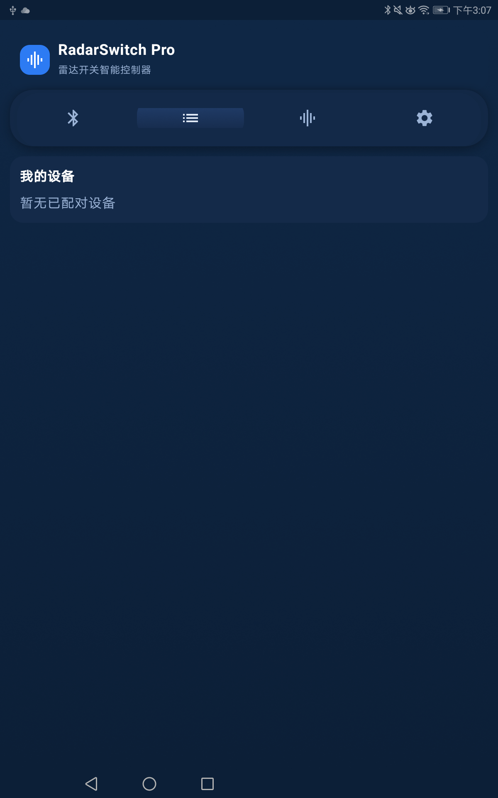

[中文](#zh) | [English](#en)

     

# RadarSwitch（雷达开关 DC59X）

RadarSwitch 是用于 CNDingtek 雷达开关 DC59X 的配置与诊断工具，基于 Android（Jetpack Compose + Kotlin）。支持通过蓝牙（BLE）扫描并连接设备、读取与修改参数、查看设备返回日志及距离信息，辅以“恢复默认”及只读模式，便于快速定位与安全调整。

## 功能说明
- 蓝牙扫描与连接：
  - 扫描附近的 DC59X 设备，选择后建立 BLE 连接。
- 参数读取与修改：
  - 进入参数配置页面可读取设备参数；退出只读模式后可进行参数修改与保存。
- 日志查看与距离诊断：
  - 支持查看设备返回的运行日志与距离信息，默认显示最近 20 条日志（可在设置页调整）。
  - 采用增量读取的"最后 N 行"策略，兼容原始日志列表被设备裁剪的情况，保证解析稳定。
  - 日志格式解析：
    - `have alarm\r\n`：检测到目标（无需解析具体信息）。
    - `no alarm\r\n`：未检测到目标。
    - `{目标类型},R:{距离值}cm,P:{能量值}\r\n`：
      - 目标类型：1 为运动目标，2 为微动目标。
      - 距离值：检测到目标的距离，单位为 cm。
      - 能量值：不进行解析。
      - 示例：`1,R:572cm,P:16\r\n` 表示检测到运动目标，距离 572cm。
      - 示例：`2,R:355cm,P:318\r\n` 表示检测到微动目标，距离 355cm。
- 恢复默认与距离计算：
  - 在“恢复默认”后进入等待设备响应状态，按设备返回令牌自动计算距离：
    - 最大距离：优先使用 `Range3/MR3`；若未收到，则保持默认值 `6.0`。
    - 最小距离：优先使用 `Range1/MR1` 并结合最大距离计算；若无法计算（例如未收到 `Range1`），兜底为 `0.0`。
  - 当最大/最小距离刷新后立即保存并结束等待状态，确保页面停留时数据能及时更新。
- 只读模式（默认开启）：
  - 进入参数页面时默认选中“只读”，避免误操作；切换为“可编辑”后可修改参数。
- 设置页：
  - 日志条数上限：提供 5、10、20 三档，默认 20。
  - 其他与诊断相关的显示/行为设置。

## 设计需求与约束
- 平台与兼容性：
  - 最低支持 `minSdk=24`，目标 `targetSdk=34`。
- 交互与安全：
  - 只读模式默认开启，需显式切换到“可编辑”后才允许修改参数。
  - 恢复默认后以设备响应为主进行距离计算，保证数据可靠性。
- 日志解析策略：
  - 增量读取采用“最后 N 行”，避免设备端裁剪导致的解析缺失。
- 构建与告警：
  - 当前版本存在 `textFieldColors`、`quadraticBezierTo` 的弃用告警，不影响功能；后续将逐步替换对应 API。

## 使用说明
1. 安装与权限：
   - 从 Release 页面下载并安装 `app-release.apk`；如已安装 Debug 版，请先卸载以避免签名冲突。
   - 首次运行时授予蓝牙与定位相关权限，用于设备扫描与连接。
2. 扫描与连接：
   - 打开应用，进入扫描页，选择列表中的 DC59X 设备并建立连接。
3. 参数查看与编辑：
   - 进入参数配置页，默认为“只读”状态；如需修改参数，切换到“可编辑”并在完成后保存。
4. 恢复默认与距离刷新：
   - 在“恢复默认”页面点击按钮后，保持停留，等待设备返回令牌：
     - 收到 `Range3/MR3` 时刷新最大距离；未收到则保持 `6.0`。
     - 收到 `Range1/MR1` 时结合最大距离刷新最小距离；未收到则最小距离兜底为 `0.0`。
   - 距离刷新会自动保存并结束等待状态，页面将显示最新值。
5. 查看日志与诊断：
   - 在日志页面查看设备最近运行记录与距离信息；默认显示 20 条，可在设置页调整上限。

## BLE 使用指南（详尽）
- 权限与系统要求：
  - Android 12 及以上（API 31+）：需要 `BLUETOOTH_SCAN` 和 `BLUETOOTH_CONNECT`；部分机型需打开系统定位开关以允许扫描。
  - Android 11 及以下（API ≤30）：需要 `BLUETOOTH`、`BLUETOOTH_ADMIN`、`ACCESS_FINE_LOCATION`。
- 扫描建议：
  - 建议靠近设备，确保设备通电并处于广播状态；列表中名称通常含有 `DC59X` 前缀。
  - 若列表为空或很少：请打开系统定位开关、确认蓝牙已启用、点击刷新并等待 5–10 秒。
- 连接与会话：
  - 连接使用 BLE GATT，无需传统蓝牙配对；建立连接后进入参数与日志会话。
  - 若连接不稳定：尝试靠近设备、重新扫描连接、关闭其他同时连接该设备的 App。
- 参数与数据：
  - 只读模式默认开启，切换到“可编辑”后方可写入参数；完成后点击保存。
  - “恢复默认”后等待设备返回令牌以刷新最大/最小距离；刷新完成会自动保存。
- 常见问题排查：
  - 看不到设备：打开定位开关并重试；检查设备是否广播且靠近。
  - 连接后无数据：重新进入诊断页或断开重连；避免多个 App 同时连接。
  - 日志过少/过多：在设置页调整“日志条数上限”为 5/10/20（默认 20）。

### 隐私与权限说明
- 为什么需要定位开关：
  - Android 将 BLE 扫描视为可能推断位置信息的行为（附近蓝牙信标可用于地理围栏/室内定位），因此许多机型在扫描时要求开启系统“定位”开关，即使应用本身不读取定位数据。
  - Android 12+ 引入了 `BLUETOOTH_SCAN`/`BLUETOOTH_CONNECT` 新权限模型；部分厂商仍将扫描与定位开关绑定以保护隐私。
- 我们的处理与承诺：
  - 本应用不采集、不存储 GPS 或网络定位数据；日志不包含位置信息。
  - 仅在前台进行必要的 BLE 扫描与连接，不进行后台持续扫描。
  - 权限仅用于发现和连接 DC59X 设备；若拒绝相关权限，你仍可浏览与扫描无关的页面。
- 数据范围：
  - 扫描仅读取设备广播信息（名称、地址/随机地址、服务 UUID），用于发现与连接设备。
  - 参数与日志仅反映设备运行状态，不包含用户个人身份信息。
- 关闭/撤销：
  - 你可随时关闭系统定位开关或撤销蓝牙相关权限；关闭后扫描不可用，但不影响其他离线页面的浏览。
- 企业/合规：
  - 应用数据存储在本机；发布的 APK 不包含将位置发送到远端的逻辑。如未来引入联网功能，将在 Release 说明中明确披露。

## 界面预览
- 扫描与连接
  
  

- 设备页
  
  

- 参数页（只读）
  
  

- 参数页（可编辑）
  
  

- 恢复默认与距离刷新
  
  

- 日志页
  
  

- 设置页
  
  

> 提示：若图片未显示，请将 PNG 截图文件按上述文件名放置到 `docs/screenshots/` 目录。

## 构建与安装
- 环境要求：
  - `JDK 17`（Android Gradle Plugin 8.x 需要 JDK 17）。
  - Android SDK（建议安装 `API 34`），不纳入仓库版本控制。
  - 使用仓库内置 `Gradle Wrapper`，无需单独安装 Gradle。
- 本地 SDK 配置（重要）：
  - 本仓库不提交 `android-sdk/` 与 `.android-sdk/`（已在 `.gitignore` 中忽略），请在开发机上本地安装 Android SDK。
  - 在项目根目录创建或编辑 `local.properties`，设置：
    - Windows 示例：`sdk.dir=C:\Android\Sdk`
    - macOS 示例：`sdk.dir=/Users/<yourname>/Library/Android/sdk`
  - 若你需要放置在自定义路径（如 `H:/radarswitch/android-sdk`），请将实际路径填入 `sdk.dir`。该文件是本地环境配置，不会被提交。
- 本地构建：
  - Debug 包：`./gradlew.bat assembleDebug`，输出位于 `app/build3/outputs/apk/debug/`。
  - Release 包：`./gradlew.bat assembleRelease`，输出位于 `app/build3/outputs/apk/release/`。
- 远端下载（仅本地开发环境可用）：
  - `http://localhost:8001/app/build3/outputs/apk/release/app-release.apk`

- 发布下载：
  - 最新版页面：https://github.com/cndingtek/radarswitch-pro/releases/latest
  - 直接下载 APK（如存在该命名）：https://github.com/cndingtek/radarswitch-pro/releases/latest/download/app-release.apk
  - 全部版本列表：https://github.com/cndingtek/radarswitch-pro/releases

## 版本信息与发布
- 当前版本：`versionCode=2`，`versionName=1.1.1`（以 `app/build.gradle.kts` 为准）。
- 标签：详见仓库 Releases。
- 变更记录：参见 `CHANGELOG.md` 的对应章节。

## 历史瘦身与协作注意
- 为瘦身仓库体积，已移除历史中的本地 SDK 目录并进行了强制更新（force push）。
- 若你本地曾基于旧历史开发，请执行以下操作以与远端同步：
  - `git fetch origin`
  - `git reset --hard origin/main`
- 请勿将本地 `android-sdk/`、`.android-sdk/`、`app/keystore/` 等本机或敏感内容提交到仓库；这些目录已在 `.gitignore` 中忽略。

## 常见问题（FAQ）
- 安装失败或提示签名冲突？
  - 先卸载旧版（尤其是 Debug 版），再安装 Release 版。
- 页面停留时最大/最小距离不刷新？
  - 触发“恢复默认”后保持停留等待设备响应；收到 `Range3/MR3`、`Range1/MR1` 后会自动刷新并保存；未收到 `Range1` 时最小距离兜底为 `0.0`。
- 日志数量太少/过多？
  - 在设置页将日志条数上限调整为 5/10/20（默认 20）。

---

## English — RadarSwitch (DC59X Radar Switch)

RadarSwitch is a configuration and diagnostics tool for the CNDingtek DC59X radar switch. It is an Android app built with Jetpack Compose and Kotlin. The app supports BLE scanning and connection, reading and modifying device parameters, viewing device logs and distance information, and provides "Restore Defaults" and a read-only mode to enable safe adjustments and quick troubleshooting.

### Features
- BLE scan and connect:
  - Scan nearby DC59X devices and establish a BLE connection.
- Read and modify parameters:
  - Open the parameter page to read device parameters; exit read-only mode to modify and save.
- Logs and distance diagnostics:
  - View recent operational logs and distance values reported by the device. By default the last 20 lines are shown (adjustable in Settings).
  - Uses an incremental "last N lines" strategy to stay robust when the device trims its original log list.
  - Log format parsing:
    - `have alarm\r\n`: Target detected (no specific information to parse).
    - `no alarm\r\n`: No target detected.
    - `{target_type},R:{distance}cm,P:{power}\r\n`:
      - target_type: 1 for moving target, 2 for micro-motion target.
      - distance: Detected target distance in cm.
      - power: Not parsed.
      - Example: `1,R:572cm,P:16\r\n` indicates a moving target at 572cm.
      - Example: `2,R:355cm,P:318\r\n` indicates a micro-motion target at 355cm.
- Restore Defaults and distance calculation:
  - After triggering Restore Defaults, the app waits for device responses and calculates distances based on returned tokens:
    - Max distance: prefer `Range3/MR3`; if not received, keep default `6.0`.
    - Min distance: prefer `Range1/MR1` and combine with Max distance; if unavailable (e.g., `Range1` not received), fallback to `0.0`.
  - Once max/min distances are refreshed, values are saved immediately and the waiting state ends so the page shows the latest data.
- Read-only mode (enabled by default):
  - The parameter page starts in read-only mode to avoid accidental changes; switch to editable to modify.
- Settings page:
  - Log count upper limit options: 5, 10, 20 (default 20).
  - Other display and behavior options related to diagnostics.

### Design Requirements & Constraints
- Platform & compatibility:
  - Minimum `minSdk=24`, target `targetSdk=34`.
- Interaction & safety:
  - Read-only is enabled by default. Editing requires an explicit switch to editable mode.
  - After Restore Defaults, distance calculations rely on device responses to ensure data reliability.
- Log parsing strategy:
  - Incremental retrieval of the "last N lines" prevents missing data when the device trims logs.
- Build warnings:
  - The current version has deprecation warnings for `textFieldColors` and `quadraticBezierTo`. Functionality is unaffected; these APIs will be replaced gradually.

### Usage
1. Install & permissions:
   - Download and install `app-release.apk` from the Releases page. Uninstall any Debug build first to avoid signature conflicts.
   - On first run, grant Bluetooth and location permissions for device scanning and connection.
2. Scan & connect:
   - Open the app, go to the Scan page, select a DC59X device from the list, and connect.
3. View & edit parameters:
   - The parameter page is read-only by default. Switch to editable to modify, then save your changes.
4. Restore Defaults & distance refresh:
   - On the Restore Defaults page, tap the button and stay on the page while waiting for device tokens:
     - On receiving `Range3/MR3`, refresh Max distance; otherwise keep `6.0`.
     - On receiving `Range1/MR1`, refresh Min distance using Max; if not received, fallback to `0.0`.
   - Distance refresh saves automatically and ends the waiting state. The page shows the latest values.
5. Logs & diagnostics:
   - Use the Logs page to inspect recent records and distance values. Default shows 20 lines; adjust the limit in Settings.

### BLE Guide (Detailed)
- Permissions & requirements:
  - Android 12+ (API 31+): `BLUETOOTH_SCAN` and `BLUETOOTH_CONNECT`. Some devices require Location toggle on for scanning.
  - Android 11 and below (API ≤30): `BLUETOOTH`, `BLUETOOTH_ADMIN`, `ACCESS_FINE_LOCATION`.
- Scanning tips:
  - Stay close to the device and ensure it is powered and advertising; names usually include `DC59X`.
  - If the list is empty: enable Location, ensure Bluetooth is on, refresh and wait 5–10 seconds.
- Connection & session:
  - BLE GATT connection is used; classic pairing is not required. After connecting, navigate to parameters and logs.
  - If the connection is unstable: move closer, rescan/reconnect, and avoid connecting with multiple apps simultaneously.
- Parameters & data:
  - Read-only mode is enabled by default; switch to editable to write parameters and save.
  - After Restore Defaults, wait for device tokens to refresh max/min distances. Values are saved automatically.
- Troubleshooting:
  - Device not visible: enable Location and retry; confirm device is advertising and nearby.
  - No data after connect: revisit diagnostics page or reconnect; avoid multiple concurrent connections.
  - Too few/many logs: adjust the log limit to 5/10/20 (default 20) in Settings.

### Privacy & Permissions
- Why Location toggle is required:
  - Android treats BLE scanning as potentially revealing location (nearby beacons enable geofencing/indoor positioning). Many devices gate scanning behind the system Location toggle, even if the app does not read location.
  - Android 12+ introduces `BLUETOOTH_SCAN`/`BLUETOOTH_CONNECT`; some OEMs still bind scanning to Location for privacy.
- Our approach & commitment:
  - The app does not collect or store GPS or network-based location; logs contain no location data.
  - Foreground-only BLE scanning and connection; no background continuous scanning.
  - Permissions are used solely to discover and connect DC59X devices; if you deny them, you can still browse non-scan pages.
- Data scope:
  - We only read BLE advertisement info (name, address/random address, service UUIDs) to discover and connect the device.
  - Parameters and logs reflect device status and do not include personal identity information.
- Disable/revoke:
  - You can turn off the system Location toggle or revoke Bluetooth-related permissions at any time; scanning becomes unavailable but offline pages remain accessible.
- Enterprise/compliance:
  - App data is stored on-device; the released APK has no logic to transmit location to servers. If online features are introduced later, Releases notes will disclose them.

### Screenshots
- Scan & Connect

  

- Devices
  
  

- Parameters (Read-only)

  

- Parameters (Editable)

  

- Restore Defaults & Distance Refresh

  

- Logs

  

- Settings

  

### Build & Install
- Requirements:
  - `JDK 17` (Android Gradle Plugin 8.x requires JDK 17).
  - Android SDK (recommend installing `API 34`). The SDK is not tracked in VCS.
  - Use the included `Gradle Wrapper`; no separate Gradle installation required.
- Local SDK configuration (important):
  - The repository ignores `android-sdk/` and `.android-sdk/` via `.gitignore`. Install the Android SDK locally on your machine.
  - Create or edit `local.properties` at the project root and set:
    - Windows example: `sdk.dir=C:\\Android\\Sdk`
    - macOS example: `sdk.dir=/Users/<yourname>/Library/Android/sdk`
  - If you use a custom path (e.g. `H:/radarswitch/android-sdk`), put the actual path in `sdk.dir`. This file is local-only and not committed.
- Local builds:
  - Debug: `./gradlew.bat assembleDebug`, output at `app/build3/outputs/apk/debug/`.
  - Release: `./gradlew.bat assembleRelease`, output at `app/build3/outputs/apk/release/`.
- Local development download:
  - `http://localhost:8001/app/build3/outputs/apk/release/app-release.apk`

- Releases & Downloads:
  - Latest: https://github.com/cndingtek/radarswitch-pro/releases/latest
  - Direct APK (if asset exists with this name): https://github.com/cndingtek/radarswitch-pro/releases/latest/download/app-release.apk
  - All releases: https://github.com/cndingtek/radarswitch-pro/releases

### Version & Release
- Current version: `versionCode=2`, `versionName=1.1.1` (see `app/build.gradle.kts`).
- Tags: see Releases in the repository.
- Changelog: see `CHANGELOG.md`.

### History Cleanup & Collaboration Notes
- The repository history was rewritten to remove local SDK directories and a forced update was pushed.
- If you previously worked off the old history, synchronize with:
  - `git fetch origin`
  - `git reset --hard origin/main`
- Do not commit local-only or sensitive content (e.g., `android-sdk/`, `.android-sdk/`, `app/keystore/`). These are already ignored in `.gitignore`.

### FAQ
- Installation fails or signature conflict?
  - Uninstall the previous build (especially Debug) and install the Release build.
- Max/min distance not refreshing while staying on the page?
  - After triggering Restore Defaults, remain on the page and wait for device tokens. On receiving `Range3/MR3` and `Range1/MR1` distances are refreshed and saved; if `Range1` is not received, Min distance falls back to `0.0`.
- Too few or too many log lines?
  - Adjust the log upper limit in Settings to 5/10/20 (default 20).
## 变更说明（2025-11-15）
- 品牌更名：由 `RadarLink Pro` 更名为 `RadarSwitch Pro`。
- 包名更新：`com.dingtek.radarlinkpro` → `com.dingtek.radarswitchpro`。
- 应用 ID 与命名空间：`radarlinkpro.dingtek.com` → `radarswitchpro.dingtek.com`。
- 应用显示名称（Manifest）：更新为 `RadarSwitch Pro`。
- 日志标识：统一使用 `RadarSwitchPro`。
- 签名别名：`radarlinkpro` → `radarswitchpro`（需确保 keystore 中存在该别名）。
- 仓库链接：README/CHANGELOG 中的发布链接更新为 `cndingtek/radarswitch-pro`。
